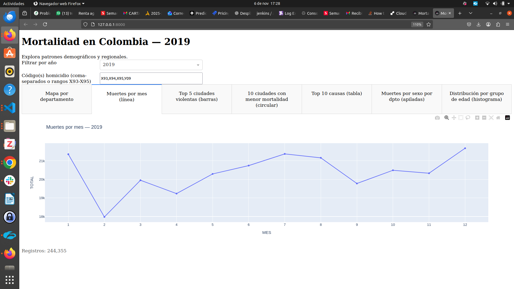
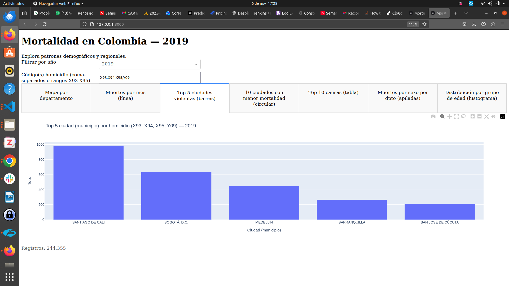
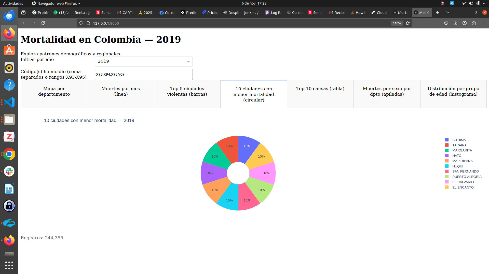
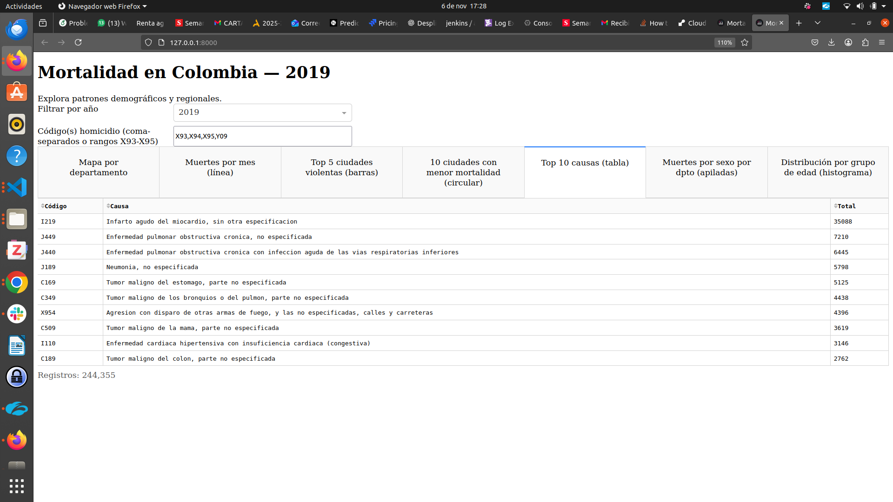
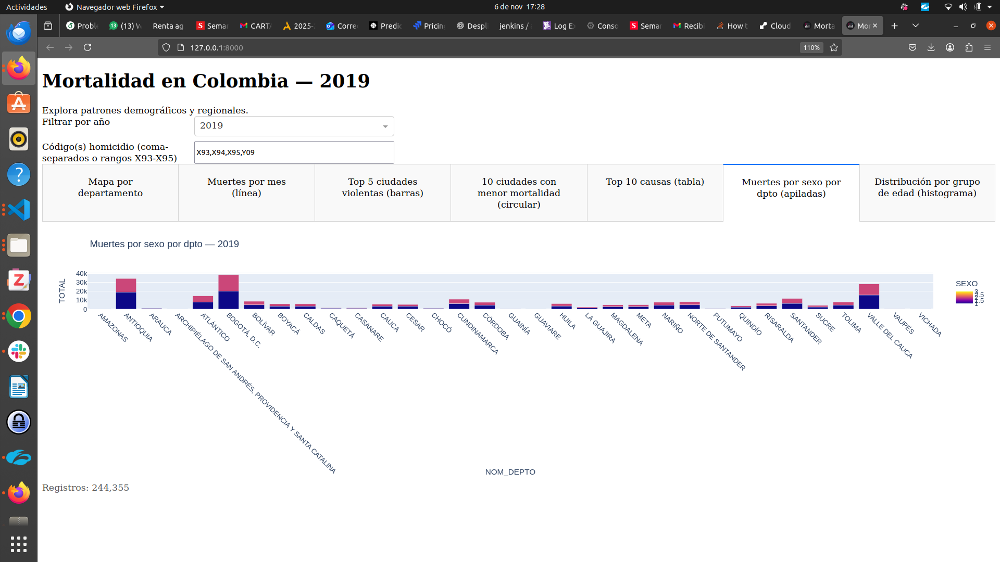

# Mortalidad en Colombia — 2019 (Dash)

## 1) Introducción del proyecto
Esta aplicación web, desarrollada con **Dash/Plotly** en **Python**, permite explorar de forma interactiva los microdatos de mortalidad **no fetal** en Colombia (EEVV 2019, DANE). Está pensada como una herramienta accesible para identificar **patrones demográficos y regionales** que faciliten el análisis, la docencia y la toma de decisiones.

## 2) Objetivo
Proveer una interfaz visual que:
- Muestre la **distribución de muertes por departamento** (mapa o barras si no hay GeoJSON).
- Permita estudiar la **estacionalidad** a través de un **gráfico de líneas** con muertes por mes.
- Identifique las **5 ciudades con mayor violencia** (homicidios, configurable por códigos CIE-10; se admiten rangos como `X93-X95`).
- Destaque las **10 ciudades con menor mortalidad** (gráfico circular).
- Presente una **tabla con las 10 principales causas de muerte** (código, nombre, total).
- Compare las **muertes por sexo** en cada departamento (barras apiladas).
- Visualice la **distribución por grupo de edad (GRUPO_EDAD1)** remapeada a categorías (neonatal, infantil, vejez, etc.).

## 3) Estructura del proyecto
```
mortalidad-colombia-app/
├─ app.py                    # Código principal de la app (Dash)
├─ requirements.txt          # Dependencias con versiones
├─ render.yaml               # Configuración de variables (referencia para otros PaaS)
├─ Procfile                  # Arranque con gunicorn (opcional para algunos PaaS)
├─ README.md                 # Este archivo
├─ tools/
│  └─ make_geojson.py        # Script para generar el GeoJSON departamental (COD_DEPTO)
└─ data/                     # Archivos de datos (no versionar si son sensibles)
   ├─ NoFetal2019.xlsx
   ├─ CodigosDeMuerte.xlsx
   ├─ Divipola.xlsx
   ├─ CodigosDeMuerte.cleaned.csv    # Generado opcionalmente para lectura rápida
   └─ colombia_departamentos.geojson # Opcional; activa el mapa coroplético
```

## 4) Requisitos
- **Python 3.10+**
- Librerías (ver `requirements.txt` con versiones):
  - `dash==2.17.1`
  - `plotly==5.24.1`
  - `pandas==2.2.2`
  - `openpyxl==3.1.5`
  - `requests==2.32.3`
  - `gunicorn==22.0.0`

Instalación rápida de dependencias:
```bash
pip install -r requirements.txt
```

## 5) Despliegue en DigitalOcean App Platform
**Pasos para desplegar desde GitHub:**

1. **Sube el proyecto a GitHub** (incluye la carpeta `data/` con los 3 Excel y, si quieres mapa, el GeoJSON).

2. **Accede a DigitalOcean App Platform**:
   - Ve a [DigitalOcean Apps](https://cloud.digitalocean.com/apps)
   - Haz clic en **"Create App"**

3. **Conecta tu repositorio**:
   - Selecciona **GitHub** como fuente
   - Autoriza DigitalOcean para acceder a tu cuenta de GitHub
   - Selecciona el repositorio del proyecto
   - Elige la rama principal (main/master)

4. **Configuración automática**:
   - DigitalOcean detectará automáticamente que es una aplicación Python
   - Confirma la configuración detectada:
     - **Build Command**: `pip install -r requirements.txt`
     - **Run Command**: `gunicorn app:server --bind 0.0.0.0:$PORT`

5. **Variables de entorno** (opcional):
   - Puedes agregar las variables definidas en `render.yaml` si es necesario
   - `DATA_DIR=data`, `MORTALITY_FILE=NoFetal2019.xlsx`, etc.

6. **Despliegue**:
   - Revisa la configuración y haz clic en **"Create Resources"**
   - DigitalOcean construirá e iniciará la aplicación automáticamente
   - Una vez completado, obtendrás una **URL pública** para tu aplicación

7. **Asegúrate** de que la carpeta `data/` contenga:
   - `NoFetal2019.xlsx` (EEVV 2019, no fetal)
   - `CodigosDeMuerte.xlsx` (catálogo CIE-10)  
   - `Divipola.xlsx` (DIVIPOLA)
   - `colombia_departamentos.geojson` (opcional, para mapa coroplético)

> **Nota sobre el mapa**: Si el GeoJSON no está presente, la pestaña “Mapa por departamento” mostrará **barras por departamento** (fallback). Con el GeoJSON (que debe incluir `properties.COD_DEPTO` = código DIVIPOLA del departamento), se activará el **coroplético**.

> **Ventajas de DigitalOcean App Platform**: Despliegue automático desde GitHub, escalado automático, SSL gratuito, y integración con el ecosistema DigitalOcean.

## 6) Software utilizado
- **Python**
- **Dash** (framework web y componentes UI)
- **Plotly** (gráficos interactivos)
- **Pandas** (manejo de datos)
- **OpenPyXL** (lectura de Excel)
- **Requests** (descarga de GeoJSON de referencia)
- **Gunicorn** (servidor WSGI para despliegue)

## 7) Instalación (ejecución local)
1. Clonar el repositorio y entrar al directorio:
   ```bash
   git clone <URL_DE_TU_REPO>.git
   cd mortalidad-colombia-app
   ```
2. (Opcional) Crear y activar entorno virtual:
   ```bash
   python -m venv .venv
   source .venv/bin/activate   # Windows: .venv\Scripts\activate
   ```
3. Instalar dependencias:
   ```bash
   pip install -r requirements.txt
   ```
4. **Colocar los datos** en `data/`:
   - `NoFetal2019.xlsx` (EEVV 2019, no fetal)
   - `CodigosDeMuerte.xlsx` (catálogo CIE-10)
   - `Divipola.xlsx` (DIVIPOLA)
   - `colombia_departamentos.geojson` (opcional, para mapa coroplético)
5. Ejecutar la aplicación:
   ```bash
   python app.py
   ```
6. Abrir en el navegador: <http://localhost:8050>

## 8) Visualizaciones con explicaciones de los resultados
A continuación se muestran las vistas con capturas. Guarda las imágenes en `docs/` y actualiza las rutas si cambias los nombres de archivo.

> **Nota**: Los totales son absolutos. Para análisis de tasas (por 100.000 hab.), agrega población por territorio/edad.

### 8.1 Mapa por departamento (coroplético)
<!--  -->

- **Qué muestra**: total de muertes por departamento en 2019.
- **Cómo leerlo**: tonos más intensos indican mayor mortalidad absoluta. El centro del país (p. ej., Antioquia, Valle del Cauca, Bogotá D.C.) suele concentrar más casos por tamaño poblacional.
- **Hallazgo clave**: útil para detectar clusters regionales y priorizar vigilancia/recursos.

### 8.2 Muertes por mes (línea)
<!--  -->

- **Qué muestra**: evolución mensual del total nacional.
- **Cómo leerlo**: picos/valles sugieren estacionalidad (clima, epidemias, periodos vacacionales).
- **Hallazgo clave**: variaciones graduales con mesetas intermedias; conviene contrastar con eventos sanitarios o climáticos.

### 8.3 Top 5 ciudades más violentas (barras)
<!--  -->

- **Qué muestra**: los 5 municipios con más homicidios según códigos CIE-10 indicados (X93,X94,X95,Y09; se aceptan rangos X93-X95).
- **Cómo leerlo**: se filtra por prefijo de 3 caracteres para capturar subcódigos (p. ej., X950).
- **Hallazgo clave**: grandes urbes (Cali, Bogotá, Medellín) concentran los totales más altos; comparar con población para tasas.

### 8.4 10 ciudades con menor mortalidad (circular)
<!--  -->

- **Qué muestra**: municipios con menores totales de muertes.
- **Cómo leerlo**: útil para contrastes (extremos inferiores) y para validar calidad de registro en territorios pequeños.
- **Hallazgo clave**: predominan municipios de baja población; contextualizar siempre con tamaño poblacional y cobertura.

### 8.5 Top 10 causas de muerte (tabla)
<!--  -->

- **Qué muestra**: principales causas (código CIE-10, nombre y total), ordenadas de mayor a menor.
- **Cómo leerlo**: permite identificar causas prioritarias (cardiovasculares, respiratorias, neoplasias, violencias).
- **Hallazgo clave**: el infarto agudo de miocardio y las enfermedades respiratorias crónicas están entre las primeras posiciones.

### 8.6 Muertes por sexo por departamento (barras apiladas)
<!--  -->

- **Qué muestra**: comparación de totales por sexo en cada departamento.
- **Cómo leerlo**: diferencias marcadas pueden sugerir patrones de riesgo diferenciados por territorio (p. ej., violencias, ocupaciones, envejecimiento).
- **Hallazgo clave**: en varios departamentos la mortalidad masculina es mayor en absolutos; requiere análisis causal y de tasas.

### 8.7 Distribución por grupo de edad (histograma)
<!--  -->

- **Qué muestra**: remapeo de GRUPO_EDAD1 a categorías del ciclo de vida (neonatal, infantil, niñez, adolescencia, juventud, adultez, vejez, longevidad, desconocida).
- **Cómo leerlo**: evidencia la concentración de muertes en vejez y longevidad, coherente con estructura poblacional y transición epidemiológica.
- **Hallazgo clave**: la mayor carga se observa en vejez; útil para planificar cuidados crónicos y salud pública focalizada.

## 9) Generación del GeoJSON (opcional, para el mapa)
Si no se cuenta  con `data/colombia_departamentos.geojson`, se debe ejecutar:
```bash
python tools/make_geojson.py
```
El script descarga un GeoJSON base, lo mapea con tu `Divipola.xlsx` y genera un archivo con `properties.COD_DEPTO` listo para `plotly.express.choropleth`.

## Comentario de entrega (plantilla)
- **Integrantes**: Casimiro Rocha
- **URL de la app** (PaaS, p. ej., Render): [https://seashell-app-7l5mu.ondigitalocean.app/](https://seashell-app-7l5mu.ondigitalocean.app/)
- **URL del repositorio** (GitHub): [https://github.com/casimiror/mortalidad-colombia-app2](https://github.com/casimiror/mortalidad-colombia-app2)
